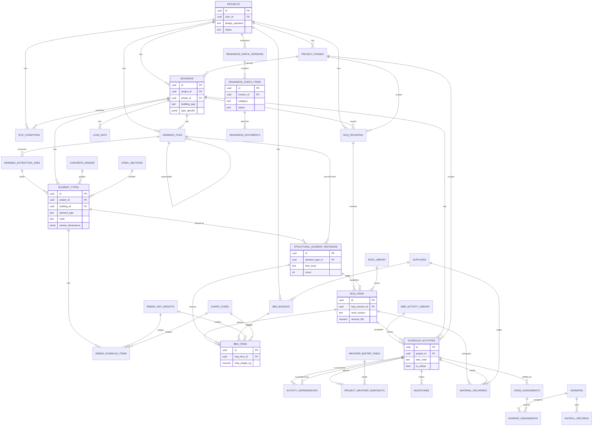

# Constistant — Comprehensive Data Schema

This document describes the full schema in [`schema.sql`](./schema.sql): a 5-tier
dependency model covering Drawing Intelligence, QuantiTake (BOQ+BBS), Construction
Planner, Resource Hub, and Readiness Check.

> **Status:** this is the target/extended schema for multi-building, phased,
> hybrid-structure projects. The current MVP tables in `js/shared/schema.js`
> (`drawing_uploads`, `beam_library`, `drawing_elements`, `boq_items`, `bbs_items`,
> `schedule_tasks`, `resource_items`, `readiness_checks`) map onto this schema as
> follows and can be migrated incrementally — see "Migration notes" at the bottom.

## ER Diagram

## Schema migration order

Tables must be created in this order to satisfy FK dependencies (matches the
order in `schema.sql`):

1. **Lookups (no deps):** `rebar_unit_weights`, `concrete_grades`, `steel_sections`, `shape_codes`, `wbs_activity_library`, `weather_buffer_table`
2. **Tier 0:** `projects` → `project_phases` → `buildings` → `site_conditions`
3. **Tier 1 (drawings):** `drawing_files` → `drawing_extraction_jobs`
4. **Tier 1 (structural):** `element_types` → `structural_element_instances` → `rebar_schedule_items`, `load_data`
5. **Tier 2 (BOQ):** `boq_revisions`, `rate_library` → `boq_items`
6. **Tier 2 (BBS):** `suppliers` → `bbs_bundles` → `bbs_items`
7. **Tier 3 (schedule):** `schedule_activities` → `activity_dependencies`, `project_weather_snapshots`, `milestones`
8. **Tier 3 (materials):** `material_deliveries`
9. **Tier 4 (resources):** `workers` → `crew_assignments` → `worker_assignments`, `productivity_rates`, `payroll_records`
10. **Tier 5 (readiness):** `readiness_check_versions` → `readiness_check_items` → `readiness_documents`

Run `schema.sql` top to bottom — it's already in this order. RLS policies (Section 10)
must be added per-table after creation; the file shows the pattern for `projects`
and `boq_items`.

## Domain rationale highlights

| Domain | Key decision | Why |
|---|---|---|
| Buildings | `buildings` table separate from `projects`, with `phase_id` | Supports multi-building sites and phased BOQs without duplicating project metadata |
| Structural library | Split `element_types` (design template, e.g. "C1") from `structural_element_instances` (per-floor count) | A drawing revision can change a count without invalidating the section/rebar design, and partial floor drawings just add instance rows |
| Drawing revisions | `drawing_files.is_active` + `superseded_by`, `drawing_extraction_jobs` always inserts new rows | Re-extraction never destroys prior BOQ/BBS lineage; "promotion" = flipping `is_active` and creating a new `boq_revisions` row |
| BOQ versioning | `boq_revisions` with `is_active` partial unique index per (project, building, phase) | Enables full BOQ recompute history while planner always reads the active revision |
| Hybrid structures | `element_types.element_type` includes both RC (`column`,`beam`,...) and steel (`steel_beam`,`steel_column`) types, keyed off the same table | A single building can mix RC floors and steel floors; no separate "steel building" schema needed |
| Standards | `design_standard` is `text + CHECK`, not a Postgres `ENUM` | Adding a 4th standard later is `ALTER TABLE ... DROP/ADD CONSTRAINT`, not a type migration |
| Rates/productivity | `rate_library` and `productivity_rates` allow `project_id IS NULL` (global) rows, project rows override | One seeded national rate table, with per-project negotiated rates layered on top |
| JSONB usage | `section_dimensions`, `bend_dimensions`, `type_specific`, `section_properties`, `raw_gemini_response`, `processing_log` | Each varies by a discriminator column (`element_type`, `shape_code`, `building_type`, `profile_type`) — normalizing would require a wide sparse table or one table per variant |
| Generated columns | `boq_items.amount_thb`, `bbs_items.total_weight_kg`, `payroll_records.amount_paid_thb`/`net_pay_thb` | Avoids drift between stored quantity/rate and displayed totals |

## Migration notes (from current MVP schema)

| Current (`js/shared/schema.js`) | New schema |
|---|---|
| `projects` | `projects` (add `province`, `design_standard`, `target_completion_date`); `floors_above_ground`/`total_area_sqm` move to `buildings` (one implicit "Building A" per project) |
| `drawing_uploads` | `drawing_files` (+ `drawing_extraction_jobs` for status/raw response) |
| `beam_library` | `element_types` (+ `rebar_schedule_items` for the per-bar fields) |
| `drawing_elements` | `structural_element_instances` |
| `boq_items` | `boq_items` (+ `boq_revisions` wrapper, `amount_thb` becomes generated) |
| `bbs_items` | `bbs_items` (bend_a/b/c/d_mm → `bend_dimensions` jsonb) |
| `schedule_tasks` | `schedule_activities` (+ `activity_dependencies` instead of `predecessor_task_ids` array) |
| `weather_snapshots` | `project_weather_snapshots` |
| `resource_items` | split into `crew_assignments` (manpower) / `material_deliveries` (materials) / `productivity_rates` |
| `supplier`, `payroll_entries` | `suppliers`, `payroll_records` (now keyed off `workers`) |
| `readiness_checks` | `readiness_check_items` (+ `readiness_check_versions` for snapshots, `readiness_documents` for attachments) |
